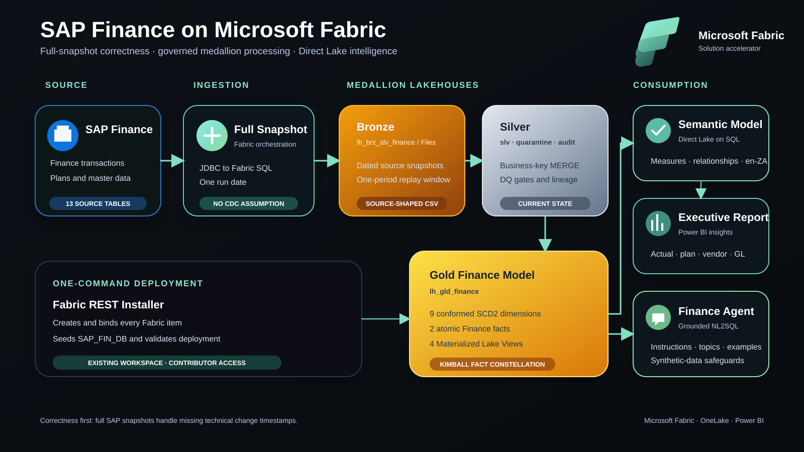

## Overview

A deployable Microsoft Fabric accelerator for SAP Finance analytics. It
includes full-snapshot ingestion, governed Silver upserts, a Kimball Gold
model, Materialized Lake Views, Direct Lake reporting, and a Fabric Data
Agent.

> [!IMPORTANT]
> All included data is synthetic demonstration data.

## Deploy

You need an existing Fabric workspace on active capacity, Python 3.11–3.13,
Azure CLI, and Contributor access.

```powershell
az login --allow-no-subscriptions
.\deployment\deploy.ps1 -Workspace "My Fabric Workspace"
```

Then run `pl_full_medallion_sap_finance` in the deployed workspace.

## Architecture



## Included

| Capability | Implementation |
|------------|----------------|
| Source | Seeded Fabric SQL Database simulating SAP HANA Finance |
| Ingestion | Identity-based full snapshots with no synthetic CDC |
| Medallion | Bronze files, Silver business-key MERGE, Kimball Gold |
| Analytics | Four Materialized Lake Views and Direct Lake on SQL |
| Consumption | Executive report and Finance Data Agent |
| Automation | Idempotent REST deployment with organized workspace folders |

## Documentation

* [Automated deployment](./deployment/README.md)
* [Pipeline and replay](./artefacts/pipeline/README.md)
* [Medallion notebooks](./artefacts/medallion/README.md)
* [SAP source and production transition](./artefacts/sap/README.md)
* [Semantic model](./artefacts/semantic/README.md)
* [Data Agent configuration](./artefacts/dataAgent/dataAgent.md)
