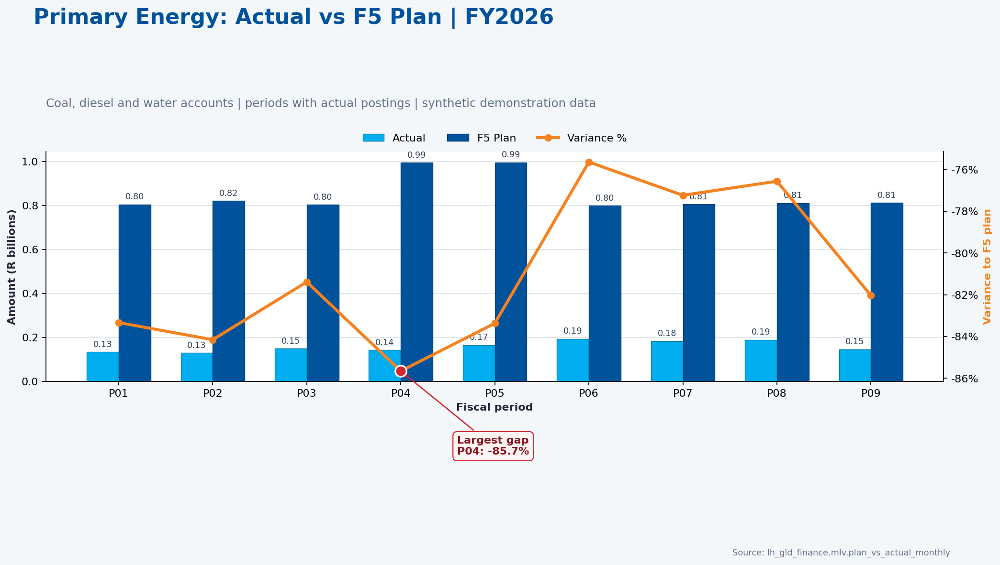

## Demo objective

Show how the SAP Finance Fabric Data Agent maintains context across three
questions, applies Finance-specific query rules, drills into a material
variance, and produces an executive dual-axis visual from
`lh_gld_finance`.

The storyline investigates Primary Energy accounts:

| GL account | Description |
|------------|-------------|
| `500100` | Primary Energy - Coal |
| `500200` | Primary Energy - Diesel |
| `500300` | Primary Energy - Water |

The demo uses synthetic demonstration data. Never present the figures as actual
Eskom performance.

## Expected duration

Allow five to seven minutes:

1. One minute for the baseline comparison
2. Two minutes for variance investigation
3. Two minutes for visual generation
4. One to two minutes for audience questions

## Before the demo

Confirm the following:

* The Data Agent uses the Preview runtime
* `lh_gld_finance` is the connected SQL source
* Agent instructions, source description, source instructions, Topics, schema
  descriptions, and example queries from
  [dataAgent.md](./dataAgent.md) are saved
* The Data Agent is published
* A new conversation is open in the test pane
* Browser zoom is suitable for the audience

Do not preselect a semantic model or Power BI report. The purpose is to show
direct Lakehouse reasoning and NL2SQL performance.

## Three-turn conversation

### Turn 1: Establish the performance baseline

Ask exactly:

> For the latest fiscal year, compare Primary Energy actuals with the F5 plan
> by fiscal period. Include coal, diesel and water, use local currency, and
> state all assumptions.

The agent should retain these context values:

| Context | Expected value |
|---------|----------------|
| Data source | `lh_gld_finance` |
| Primary table | `mlv.plan_vs_actual_monthly` |
| Latest actual fiscal year | 2026 |
| Plan version | F5 |
| GL scope | `500100`, `500200`, `500300` |
| Currency basis | Local currency, ZAR in the synthetic companies |
| Actual periods | 1 through 9 |

The answer should explain that actual and F5 plan rows require conditional
aggregation. It must not apply `WHERE plan_version = 'F5'` to the complete
query because that would remove actual rows.

Expected trend:

| Period | Actual Rbn | F5 plan Rbn | Variance Rbn | Variance % |
|-------:|-----------:|-------------:|-------------:|-----------:|
| P01 | 0.134 | 0.804 | -0.670 | -83.3% |
| P02 | 0.130 | 0.820 | -0.690 | -84.2% |
| P03 | 0.149 | 0.803 | -0.654 | -81.4% |
| P04 | 0.143 | 0.994 | -0.851 | -85.7% |
| P05 | 0.165 | 0.995 | -0.829 | -83.4% |
| P06 | 0.195 | 0.799 | -0.604 | -75.6% |
| P07 | 0.183 | 0.805 | -0.622 | -77.2% |
| P08 | 0.190 | 0.811 | -0.621 | -76.6% |
| P09 | 0.146 | 0.812 | -0.666 | -82.0% |

Presenter cue:

> Notice that the agent selected the monthly Gold MLV instead of scanning the
> atomic finance fact and correctly kept actual rows while selecting F5.

### Turn 2: Investigate the largest gap

Without starting a new conversation, ask:

> Keep the same fiscal year, F5 version, Primary Energy scope and local
> currency. Restrict the analysis to periods with actual postings. Which
> period has the largest negative actual-to-plan gap? Break that period down
> into coal, diesel and water. Describe direction only, not whether it is
> favorable.

This turn deliberately omits the values established in Turn 1. The agent
should carry them forward rather than asking for the year, version, accounts,
or currency again.

Expected finding:

* Fiscal period 4 has the largest negative gap
* Actual: R0.143bn
* F5 plan: R0.994bn
* Variance: -R0.851bn
* Variance percentage: -85.7%

Expected period 4 breakdown:

| GL account | Description | Actual Rm | F5 plan Rm | Variance Rm |
|------------|-------------|----------:|------------:|------------:|
| `500100` | Primary Energy - Coal | 32.0 | 326.8 | -294.8 |
| `500300` | Primary Energy - Water | 48.1 | 338.0 | -289.9 |
| `500200` | Primary Energy - Diesel | 62.4 | 329.0 | -266.6 |

The answer must not claim that the negative gap is favorable or unfavorable.
That conclusion requires confirmed expense sign and business-performance
rules.

Presenter cue:

> The second question relies on conversational context and demonstrates that
> the agent can move from an executive trend to a material period and then to
> account-level drivers.

### Turn 3: Generate the executive visual

Continue in the same conversation and ask:

> Create a dual-axis chart with clustered actual and F5 plan columns in R
> billions on the left axis and a variance-percentage line on the right axis.
> Sort periods chronologically, use Eskom blue for plan, cyan for actual and
> orange for variance, and highlight the largest negative gap with a red
> annotation. Title it "Primary Energy: Actual vs F5 Plan | FY2026" and label
> the data as synthetic.

The agent should not run a different business query unless visual preparation
requires reshaping the same result set.

Expected visual specification:

| Element | Specification |
|---------|---------------|
| X-axis | Fiscal periods P01-P09 |
| Left Y-axis | Actual and F5 plan, R billions |
| Right Y-axis | Variance to F5 plan, percentage |
| Actual columns | Eskom cyan `#00AEEF` |
| F5 plan columns | Eskom blue `#00529B` |
| Variance line | Eskom orange `#F58220` |
| Exception marker | Eskom red `#D22630` on P04 |
| Annotation | `Largest gap P04: -85.7%` |
| Footer | `Source: lh_gld_finance.mlv.plan_vs_actual_monthly` |

## Expected final visual



If Code Interpreter fails once, use this recovery prompt:

> The result table is already available. Use Code Interpreter only. Execute
> Python with pandas and matplotlib, use `twinx()`, and render one PNG inline
> in this chat. Do not create or export a PDF, report, or other file. Do not
> call a chart-rendering or deployment service.

If Code Interpreter remains unavailable, use the image above as the presenter
fallback. Explain that the underlying result came from the Data Agent and only
inline rendering failed.

## Validated reference SQL

This SQL was executed successfully against the deployed
`lh_gld_finance` SQL endpoint. It is included for demo troubleshooting, not for
the presenter to show by default.

```sql
WITH y AS (
  SELECT MAX(fiscal_year) fy
  FROM mlv.plan_vs_actual_monthly
  WHERE scenario='ACTUAL'
), x AS (
  SELECT p.fiscal_year,p.fiscal_period,p.fiscal_period_key,
    SUM(CASE WHEN p.scenario='ACTUAL'
        THEN p.actual_amount_local ELSE 0 END) actual_local,
    SUM(CASE WHEN p.scenario='PLAN' AND p.plan_version='F5'
        THEN p.plan_amount_local ELSE 0 END) plan_f5_local
  FROM mlv.plan_vs_actual_monthly p
  JOIN dim.gl_account g ON g.DIMENSION_SK=p.gl_account_sk
  CROSS JOIN y
  WHERE p.fiscal_year=y.fy
    AND g.SAKNR IN ('500100','500200','500300')
  GROUP BY p.fiscal_year,p.fiscal_period,p.fiscal_period_key
)
SELECT fiscal_year,fiscal_period,actual_local,plan_f5_local,
       actual_local-plan_f5_local variance_local,
       (actual_local-plan_f5_local)/NULLIF(ABS(plan_f5_local),0) variance_pct
FROM x
WHERE actual_local<>0
ORDER BY fiscal_period_key;
```

## Presenter success criteria

The demo succeeds when:

* Turn 1 uses the Gold MLV and returns 2026 periods 1-9
* Turn 2 retains year, version, account scope, and currency context
* Turn 2 identifies P04 and the three account drivers
* Turn 3 preserves the result set and creates or specifies the dual-axis chart
* The response states that the figures are synthetic
* No semantic model is used
* No restricted tax, batch, hash, file, or load metadata is exposed

## Recovery prompts

If the agent loses context, use:

> Continue from the immediately preceding Primary Energy analysis. Retain
> fiscal year 2026, F5, accounts 500100/500200/500300, local currency and
> periods with actual postings.

If the agent applies F5 to actual rows, use:

> Recalculate using conditional aggregation. Keep ACTUAL rows regardless of
> plan version and apply F5 only to PLAN rows.

If the visual includes periods 10-16 with no actuals, use:

> Keep only periods where the actual amount is nonzero. Do not treat SAP
> special periods as calendar months.
